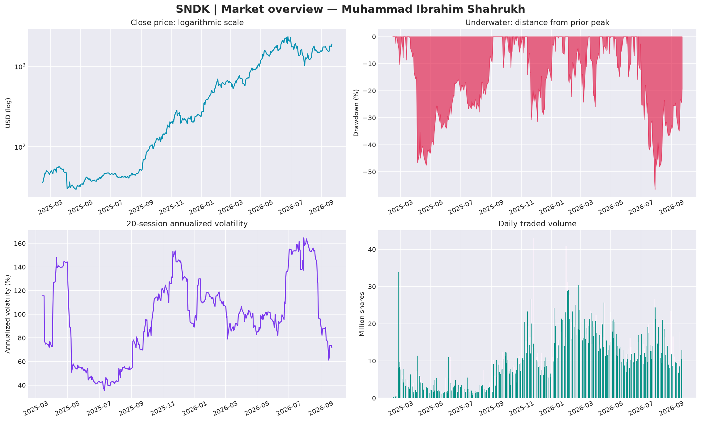
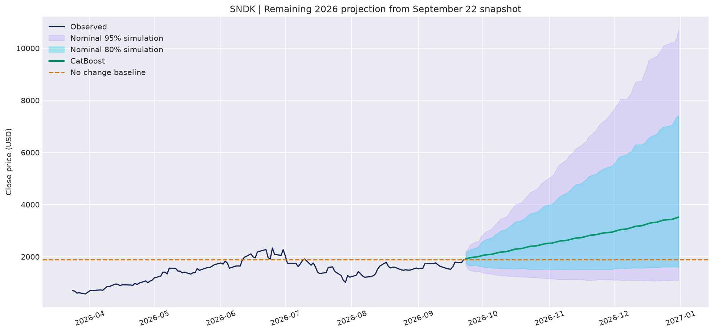

# SNDK Stock Data: EDA & 2026 Forecast

**Muhammad Ibrahim Shahrukh** · Reproducible data science · Yahoo Finance/yfinance snapshot

A beginner-friendly Sandisk stock dataset and an executed research notebook covering data quality, interactive EDA, eight forecast candidates, chronological validation and uncertainty-aware projections through December 2026.



## Quick facts

| Item | Value |
|---|---|
| Historical coverage | 2025-02-13 to 2026-09-22 |
| Clean observations | 403 rows × 7 columns |
| Main model sample | 397 regular-listing observations |
| Forecast origin | 2026-09-22 |
| Forecast horizon | 70 scheduled sessions, ending 2026-12-31 |
| Validation-selected candidate | CatBoost |
| Untouched test RMSE | $1,032.98 |
| Untouched test MAPE | 62.43% |
| RMSE skill versus no-change baseline | -1.755 |

The selected model is the best candidate **under the stated validation protocol**, not a universally best model. It did not beat the no-change baseline on the held-out path, which weakens confidence in the final projection. See [the executed analysis](sndk_eda_forecast_2026.ipynb) and [findings](outputs/analysis_summary.md).

## Files

| File | Purpose |
|---|---|
| `sndk_eda_forecast_2026.ipynb` | Main notebook with executed cells and saved outputs |
| `sndk_eda_forecast_2026.html` | Browser-readable notebook export |
| `data/sndk_daily_clean.csv` | Clean historical OHLCV data |
| `data/raw/sndk_yfinance_original.csv` | Unmodified input snapshot |
| `outputs/sndk_forecast_remaining_2026.csv` | Separate future model estimates and simulation envelopes |
| `outputs/sndk_analysis_features.csv` | Trailing descriptive indicators |
| `outputs/*metrics.csv` | Actual validation and test metrics |
| `outputs/*predictions.csv` | Historical validation/test predictions |
| `outputs/analysis_summary.md` | Data-driven findings and limitations |
| `outputs/run_summary.json` | Machine-readable results and environment |
| `outputs/execution_report.json` | Execution method, cell count and output checks |
| `KAGGLE_DATASET_CARD.md` | Ready-to-paste title, subtitle and descriptions |
| `DATA_DICTIONARY.md` | Column definitions and units |
| `PROVENANCE.md` | Source chain, transformations, hash and collection example |
| `COVER_IMAGE_PROMPT.md` | Dataset-cover generation prompt |
| `clean_data.py` | Rebuild and validate the clean CSV from the raw export |
| `requirements.txt` | Pinned tested environment |
| `.gitignore` | Local environments, secrets, caches and temporary files |

## Run locally

Tested with Python 3.12. From the extracted repository folder:

```bash
python -m venv .venv
# Windows PowerShell:
.venv\Scripts\Activate.ps1
# macOS/Linux (use this instead of the Windows line):
source .venv/bin/activate
python -m pip install -r requirements.txt
python clean_data.py
python -m ipykernel install --user --name sndk-project --display-name "Python (SNDK)"
```

Open the notebook in VS Code/Jupyter using that kernel and choose **Run All**. If you want JupyterLab's browser editor, install it separately with `python -m pip install jupyterlab`, then run `jupyter lab`.

To execute from a normal local terminal with Jupyter kernel sockets available:

```bash
jupyter nbconvert --to notebook --execute sndk_eda_forecast_2026.ipynb --inplace --ExecutePreprocessor.timeout=900 --ExecutePreprocessor.kernel_name=sndk-project
```

The delivered notebook's code cells were executed sequentially in a fresh in-process IPython session because kernel sockets are unavailable in the build environment. Outputs were captured and the notebook schema validated. This was not executed inside Kaggle's hosted service; the automatic Kaggle path loader and output destination are included for portability.

## Run on Kaggle

1. Confirm the right to publicly redistribute the source prices; see the rights note below.
2. Create a dataset with `data/sndk_daily_clean.csv`. Use the title/subtitle/description in `KAGGLE_DATASET_CARD.md` and column descriptions in `DATA_DICTIONARY.md`.
3. Import `sndk_eda_forecast_2026.ipynb` as a new Kaggle notebook and add your dataset as input.
4. Use a CPU notebook. The loader searches `/kaggle/input` for `sndk_daily_clean.csv`; if more than one exists, set `DATA_PATH` to the desired file.
5. Run All. Results go to `/kaggle/working/sndk_outputs`. No live download or API key is needed. If your Kaggle image lacks a required package, install it in a setup cell with Internet enabled before running the analysis.
6. Keep future predictions separate from historical data. Save a notebook version with outputs.

Plotly uses a notebook-compatible interactive renderer and embedded JavaScript. Static Matplotlib overviews, diagnostics and forecasts also appear as PNG outputs. GitHub may not render interactive HTML; use the static panels or open the HTML export in a browser. Trust the notebook locally to enable rich HTML.

## Methodology

Data validation preserves all supplied records and does not fill, clip, round to cents or silently adjust prices. EDA examines trend, tails, volume, risk, monthly/weekday patterns, relationships and stationarity. The main models exclude six pre-regular-listing records, with a separate sensitivity check retaining them.

Each model predicts next-session log returns using trailing close-derived features, then recursively produces the entire horizon without consuming intermediate realized prices. Three non-overlapping, expanding-window validation blocks select the smallest mean origin-normalized RMSE. The final equally long historical block is untouched during selection. All eight models are reported on that test without reselecting its winner. The chosen candidate is then refitted on all available model data.

Models: random walk; trailing 63-session log drift; Ridge; Random Forest; Extra Trees; histogram gradient boosting; XGBoost; CatBoost. Fixed hyperparameters and random seed are visible in the notebook. Metrics include MAE, RMSE, normalized RMSE, MAPE, sMAPE, MASE, R² and same-horizon baseline skill. Simulated uncertainty uses centered five-session blocks of the most recent 126 historical log returns; nominal envelopes are not calibrated prediction intervals.

## Forecast interpretation

The December 31 point estimate is **$3,518.95** from a last supplied close of **$1,887.04**. The nominal 80% simulated envelope is **$1,601.99–$7,408.87**. These are model outputs conditional on the supplied data, not verified price targets. The file contains no earnings, valuation, macroeconomic or future corporate-action inputs. The short history, regime changes, recursive error and unknown adjustment status limit reliability.



## Provenance and citation

The source was reported by the uploader as Yahoo Finance, collected using yfinance. Original collection time/version/parameters were not supplied. Prices were not independently reconciled. See [PROVENANCE.md](PROVENANCE.md) for transparent transformations and a fresh-collection example.

> Shahrukh, Muhammad Ibrahim. *SNDK Stock Data: EDA & 2026 Forecast*. Prepared 2026-09-24 from a user-supplied Yahoo Finance/yfinance snapshot ending 2026-09-22.

- [Yahoo Finance SNDK history](https://finance.yahoo.com/quote/SNDK/history/)
- [yfinance documentation](https://ranaroussi.github.io/yfinance/)
- [Sandisk listing announcement](https://investor.sandisk.com/news-releases/news-release-details/sandisk-celebrates-nasdaq-listing-after-completing-separation)
- [Nasdaq market schedule](https://www.nasdaq.com/market-activity/stock-market-holiday-schedule)

**Rights:** No open-data redistribution license is established for these source prices. yfinance's code license does not license Yahoo market data. Review the source terms and obtain any necessary permission before publishing price-containing data, notebooks or outputs. No blanket open-source/data license is added without the author's choice. This is educational research, not investment advice.

## Publish to GitHub

Suggested repository name: **`sndk-stock-forecast-2026`**

Suggested description: **Sandisk stock EDA and 2026 forecasting with Plotly, eight model baselines, chronological evaluation and reproducible data documentation.**

Upload the complete curated project folder to keep the data, documentation and notebook together, subject to source-data rights. Create an empty GitHub repository with the name above, then run these commands from this folder. Replace `YOUR_USERNAME` with your GitHub username:

```bash
git init
git add .
git commit -m "Add SNDK dataset, EDA and evaluated 2026 forecasts"
git branch -M main
git remote add origin https://github.com/YOUR_USERNAME/sndk-stock-forecast-2026.git
git push -u origin main
```

If using an existing repository, inspect its current branch and remote before adapting these first-upload commands. This package has not been published to GitHub or Kaggle automatically.
